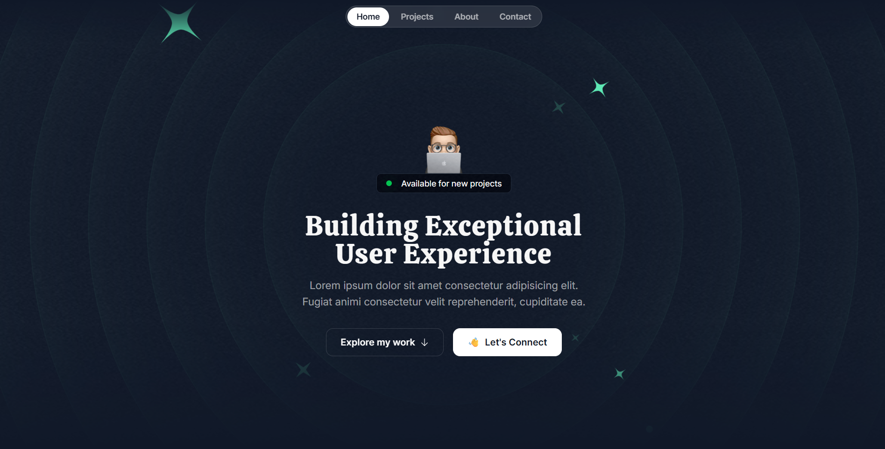
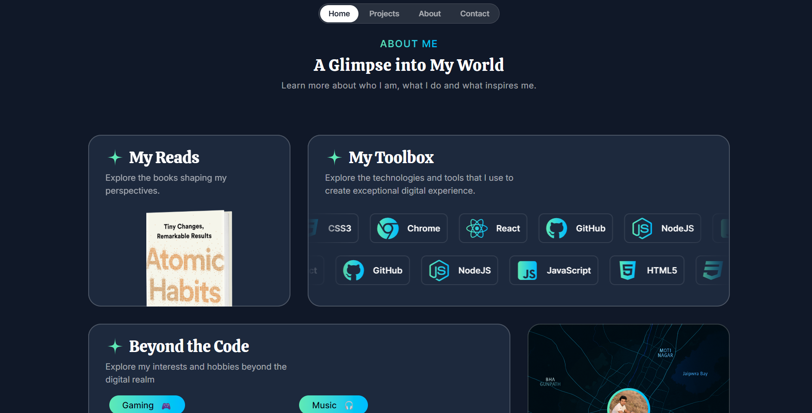

# React Portfolio Website

This is a modern portfolio website built with React, Vite, and Tailwind CSS. It showcases my projects, skills, and provides a way for visitors to contact me.

## 🚀 Features

- **Component-based architecture:** Built with reusable React components.
- **Modern tooling:** Utilizes Vite for a fast development experience.
- **Responsive design:** Styled with Tailwind CSS for a mobile-first approach.
- **Animations:** Uses Framer Motion for smooth animations and transitions.

## 🖼️ Screenshots

_A placeholder for screenshots of the project. You can add your screenshots here._




## 🛠️ Technologies Used

- **Frontend:** React, TypeScript
- **Styling:** Tailwind CSS
- **Build Tool:** Vite
- **Animations:** Framer Motion
- **Linting:** ESLint

## ⚙️ Getting Started

To get a local copy up and running, follow these simple steps.

### Prerequisites

- Node.js (v18 or higher)
- npm

### Installation

1.  Clone the repo
    ```sh
    git clone https://github.com/your-username/your-repo-name.git
    ```
2.  Install NPM packages
    ```sh
    npm install
    ```
3.  Start the development server
    ```sh
    npm run dev
    ```

## 📜 Available Scripts

In the project directory, you can run:

- `npm run dev`: Runs the app in the development mode.
- `npm run build`: Builds the app for production.
- `npm run lint`: Lints the code using ESLint.
- `npm run preview`: Serves the production build locally.

## 🙏 Acknowledgements

- [Vite](https://vitejs.dev/)
- [React](https://reactjs.org/)
- [Tailwind CSS](https://tailwindcss.com/)
- [Framer Motion](https://www.framer.com/motion/)

